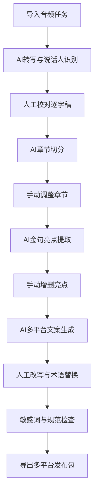

## 1. 产品概述

播客AI整理平台是一款面向播客制作团队的AI自动化工具，将长音频内容转化为多平台可发布的完整素材包。通过导入任务、转写校对、章节切分、亮点提取、文案生成、发布包检查六大核心模块，帮助创作者大幅缩短后期制作周期，提升内容质量。

- 核心目标：将播客音频后期处理效率提升 80%，从原始音频到发布包的一站式自动化
- 目标用户：播客主播、内容运营团队、音频媒体机构
- 市场价值：填补播客内容生产流水线的智能化空白

## 2. 核心功能

### 2.1 用户角色

| 角色 | 注册方式 | 核心权限 |
|------|----------|----------|
| 创作者 | 本地启动即用 | 全部功能使用、项目管理、素材导出 |
| 审核员 | 本地启动即用 | 转写校对、敏感词审核、人工改写 |

### 2.2 功能模块

1. **导入任务面板**：批量音频导入、任务队列管理、处理进度追踪、失败重试机制
2. **转写校对工作台**：说话人识别、逐字稿展示、口误标记、实时校对编辑
3. **章节切分视图**：主题分段、时间轴可视化、章节命名、拖拽调整
4. **亮点提取面板**：金句自动识别、手动添加亮点、时间戳关联
5. **文案生成中心**：标题/摘要/Shownotes/社媒短文/封面提示词生成、术语替换、人工改写
6. **发布包检查器**：敏感词扫描、多平台适配检查、发布包预览与导出

### 2.3 页面详情

| 页面名称 | 模块名称 | 功能描述 |
|----------|----------|----------|
| 导入任务面板 | 批量上传区 | 拖拽上传多音频文件，显示文件信息，支持格式校验 |
| 导入任务面板 | 任务队列 | 任务状态展示（等待/处理中/完成/失败），进度条，重试按钮 |
| 转写校对工作台 | 逐字稿编辑器 | 时间轴对齐的字幕编辑，说话人标签切换，口误高亮标记 |
| 转写校对工作台 | 音频播放器 | 播放控制，变速播放，段落跳转，波形预览 |
| 章节切分视图 | 时间轴视图 | 可视化章节分割线，拖拽调整边界，章节缩略预览 |
| 章节切分视图 | 章节列表 | 各章节标题、时长、字数统计，主题关键词 |
| 亮点提取面板 | 金句卡片墙 | AI提取金句瀑布流展示，支持点赞/收藏/删除 |
| 亮点提取面板 | 时间戳关联 | 每个金句关联原始音频位置，一键跳转试听 |
| 文案生成中心 | 多平台文案 | 标题变体、摘要、Shownotes、小红书/微博/公众号短文 |
| 文案生成中心 | 术语管理 | 自定义术语库，一键替换，敏感词配置 |
| 发布包检查器 | 检查清单 | 敏感词检测、字数合规、格式规范、平台适配项逐项检查 |
| 发布包检查器 | 导出中心 | 按平台打包导出（小宇宙/喜马拉雅/公众号/小红书），zip下载 |

## 3. 核心流程

用户从导入音频开始，依次经过六个模块完成处理：上传音频 → AI自动转写与说话人识别 → 人工校对逐字稿 → AI按主题切分章节并手动调整 → AI提取金句亮点 → 生成多平台文案并人工改写 → 敏感词与规范检查 → 导出多平台发布包。

## 4. 用户界面设计

### 4.1 设计风格

- 主色调：深靛蓝 (#1e1b4b) 作为主色，琥珀橙 (#f59e0b) 作为强调色，暖灰白 (#fafaf9) 背景
- 辅助色：翡翠绿 (#10b981) 表示成功状态，玫瑰红 (#f43f5e) 表示错误/警告
- 按钮风格：圆润胶囊形 (rounded-full)，主按钮采用渐变填充带微光效果
- 字体：标题使用 Playfair Display 衬线字体营造播客文化氛围，正文使用 Noto Sans SC 确保中文可读性
- 布局：左侧导航栏 + 顶部面包屑 + 主工作区的三栏式专业工作台布局
- 图标风格：Lucide 线性图标，配合彩色徽章点缀
- 视觉细节：玻璃拟态卡片 (backdrop-blur)、微噪点纹理背景、柔和投影分层

### 4.2 页面设计概览

| 页面名称 | 模块名称 | UI 元素 |
|----------|----------|---------|
| 导入任务面板 | 批量上传区 | 大型虚线拖拽区、文件卡片网格、上传进度条动画 |
| 导入任务面板 | 任务队列 | 表格视图、状态彩色徽章、进度动画、重试按钮 |
| 转写校对工作台 | 逐字稿编辑器 | 左右双栏（音频+文稿）、说话人彩色标签、口误红色波浪线 |
| 章节切分视图 | 时间轴视图 | 横向波形图、可拖拽分割线、章节彩色分段块 |
| 亮点提取面板 | 金句卡片墙 | Masonry瀑布流、卡片悬浮放大、收藏心形动画 |
| 文案生成中心 | 多平台文案 | Tab切换不同平台、卡片式文案块、AI重新生成按钮微光效果 |
| 发布包检查器 | 检查清单 | 逐项勾选动画、进度圆环、通过/失败状态图标 |

### 4.3 响应式

采用桌面优先设计，主工作区在 1440px 宽度下呈现最佳三栏布局；在 1024px 以下自动折叠为两栏，左侧导航变为可收起抽屉；移动端保持单栏纵向滚动，关键操作按钮固定底部。触摸屏设备优化拖拽和点击区域。
