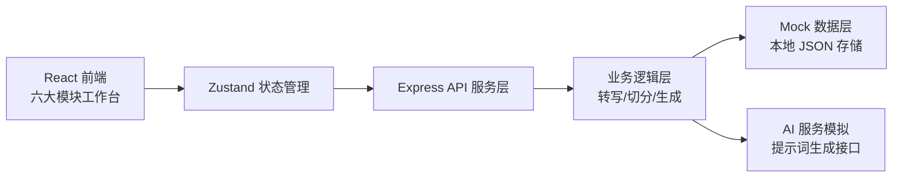
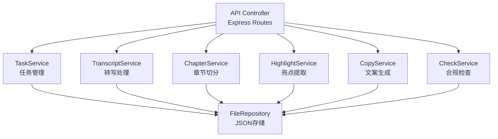
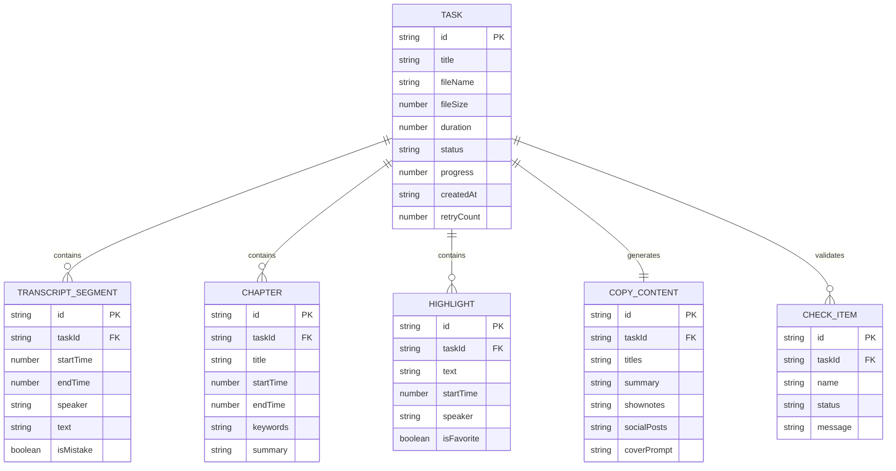

## 1. 架构设计



## 2. 技术描述

- **前端**：React@18 + TypeScript + Vite@5 + TailwindCSS@3 + Zustand@4 + React Router@6 + Lucide React
- **初始化工具**：vite-init
- **后端**：Express@4 + TypeScript
- **数据存储**：本地 JSON 文件模拟持久化（无数据库，前端可独立运行）
- **UI 组件**：自定义组件库，不引入第三方组件框架

## 3. 路由定义

| 路由 | 用途 |
|------|------|
| /tasks | 导入任务面板（首页） |
| /transcript/:taskId | 转写校对工作台 |
| /chapters/:taskId | 章节切分视图 |
| /highlights/:taskId | 亮点提取面板 |
| /copywriting/:taskId | 文案生成中心 |
| /checklist/:taskId | 发布包检查器 |

## 4. API 定义

```typescript
// 任务相关
interface Task {
  id: string;
  title: string;
  fileName: string;
  fileSize: number;
  duration: number;
  status: 'pending' | 'processing' | 'completed' | 'failed';
  progress: number;
  createdAt: string;
  error?: string;
  retryCount: number;
}

interface TranscriptSegment {
  id: string;
  startTime: number;
  endTime: number;
  speaker: string;
  text: string;
  isMistake?: boolean;
  mistakeType?: 'pronunciation' | 'grammar' | 'filler';
}

interface Chapter {
  id: string;
  title: string;
  startTime: number;
  endTime: number;
  keywords: string[];
  summary: string;
}

interface Highlight {
  id: string;
  text: string;
  startTime: number;
  speaker: string;
  isFavorite: boolean;
}

interface CopyContent {
  titles: string[];
  summary: string;
  shownotes: string;
  socialPosts: {
    xiaohongshu: string;
    weibo: string;
    official: string;
  };
  coverPrompt: string;
}

interface CheckItem {
  id: string;
  name: string;
  status: 'pass' | 'fail' | 'warning' | 'pending';
  message: string;
  details: string[];
}

// API 端点
// GET    /api/tasks              获取任务列表
// POST   /api/tasks/upload       上传音频任务
// POST   /api/tasks/:id/retry    重试失败任务
// GET    /api/tasks/:id/transcript    获取转写内容
// PUT    /api/tasks/:id/transcript    更新校对内容
// GET    /api/tasks/:id/chapters      获取章节
// PUT    /api/tasks/:id/chapters      更新章节
// GET    /api/tasks/:id/highlights    获取亮点
// POST   /api/tasks/:id/highlights    新增亮点
// GET    /api/tasks/:id/copy          获取文案
// POST   /api/tasks/:id/copy/regenerate 重新生成
// GET    /api/tasks/:id/checklist     获取检查结果
// POST   /api/tasks/:id/export        导出发布包
```

## 5. 服务端架构图



## 6. 数据模型

### 6.1 数据模型定义



### 6.2 初始化数据

使用 Mock 数据预置 3 个示例任务，包含完整的转写内容、章节、亮点和文案，便于直接演示六大模块功能。
